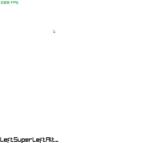

# Dijkstra Algorithm Visualizer

A real-time, interactive graph editor and pathfinding visualization tool built with C# and Raylib_cs. Create, edit, and visualize graphs, then solve shortest-path problems using Dijkstra’s algorithm (and Bellman–Ford) right in the window.

## Features

- Interactive graph editing:
  - Add/remove vertices and edges via text commands
  - Select, move, and highlight vertices with the mouse
- Live camera controls (pan & zoom)
- Command console at the bottom of the screen
- Real-time visualization of:
  - Dijkstra’s shortest-path algorithm
  - Bellman–Ford algorithm
- Save/load graphs to/from disk
- Random graph generation and shuffling
- Optional fullscreen toggle and FPS display

## Screenshot

## Requirements

- .NET 6.0 SDK or higher
- Raylib_cs (>= 4.0)
- A graphics-capable platform supported by Raylib (Windows, Linux, macOS)

## Getting Started

1. Clone this repository  
   `git clone https://github.com/your-username/dijkstra-visualizer.git`

2. Navigate into the project folder  
   `cd dijkstra-visualizer`

3. Restore NuGet packages  
   `dotnet restore`

4. Build and run  
   `dotnet run --project DijkstraAlgorithm`

## How to Use

When the application launches, you’ll see a blank canvas. Toggle typing mode with `Tab`. In typing mode, enter commands in the console at the bottom. Press `Enter` to execute.

### Basic Commands

- `ADD <name>`  
  Create a new vertex at the current camera focus with the given name.  
- `ADD <name> <color>` 
  RED,  GREEN, BLACK, BLUE, YELLOW;
  Create a vertex and display a custom color.

- `DEL <name>`  
  Remove the vertex (and all its edges).

- `DEL <name1> <name2>`  
  Remove the edge between two vertices.

- `CON <name1> <name2>`  
  Connect two existing vertices with an undirected edge.

- `SEL <name>`  
  Select a vertex to move it with the mouse.  
- `SEL`  
  Deselect the current vertex.

- `RAND`  
  Shuffle all vertices to random positions.

- `NEW`  
  Clear the entire graph.

- `ABC`  
  Quickly generate 5 labeled nodes (`A` → `E`) and shuffle them.

### Pathfinding Commands

- `DEX <start>`  
  Solve shortest paths from `<start>` using **Dijkstra’s algorithm**.  
  Outputs each vertex, its distance, and path.

- `BELL <start>`  
  Solve single-source shortest paths with **Bellman–Ford**.  
  Outputs distances and paths; detects negative cycles.

### File I/O

- `SAVE <filename>`  
  Save the current graph to disk as `<filename>.json`.

- `LOAD <filename>`  
  Load a previously saved graph from disk.

### Camera & View

- Pan: Click-and-drag the background  
- Zoom: Mouse wheel  
- Fullscreen Toggle: Press `F`

### Miscellaneous

- `P` (when not typing): Print graph data to console  
- `ESC` or close window: Exit application  
- FPS counter in the top-left corner  

## Code Overview

- **Program.cs**: Main loop, input handling, rendering, and command dispatcher  
- **Graph.cs**: Data model for vertices and edges, plus drawing routines  
- **DijkstraSolve.cs**: Implements Dijkstra’s algorithm  
- **BellFord.cs**: Implements Bellman–Ford algorithm  
- **GraphManager.cs**: Save/load functionality (JSON serialization)  
- **FlyingCamera.cs**: 2D pan-and-zoom camera controlled by mouse/wheel  

## Contributing

1. Fork this repository  
2. Create your feature branch (`git checkout -b feature/my-cool-feature`)  
3. Commit your changes (`git commit -am 'Add some feature'`)  
4. Push to your branch (`git push origin feature/my-cool-feature`)  
5. Open a Pull Request

Please adhere to existing code style and include tests/examples when appropriate.

## License

This project is licensed under the MIT License. See the [LICENSE](LICENSE) file for details.
